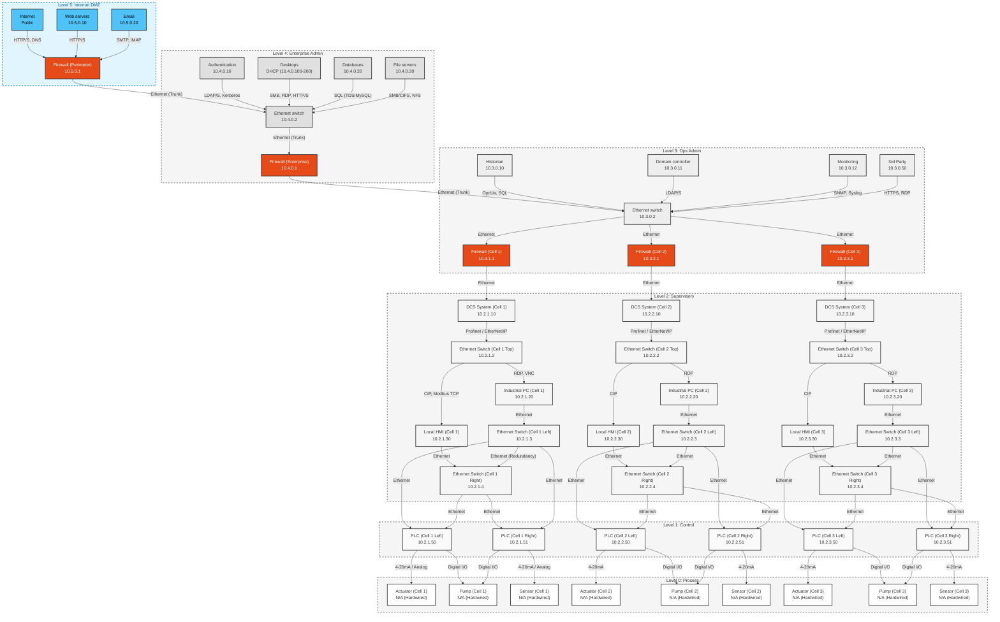

```mermaid
flowchart TD
    %% Classes definitions
    classDef internet fill:#4fc3f7,stroke:#333,stroke-width:2px,color:black
    classDef firewall fill:#e64a19,stroke:#333,stroke-width:2px,color:white
    classDef level4 fill:#e0e0e0,stroke:#333,stroke-width:2px
    classDef level3 fill:#eeeeee,stroke:#333,stroke-width:2px
    classDef level2 fill:#f5f5f5,stroke:#333,stroke-width:2px
    classDef level1 fill:#fafafa,stroke:#333,stroke-width:2px
    classDef level0 fill:#ffffff,stroke:#333,stroke-width:2px
    classDef default fill:#f9f9f9,stroke:#333,stroke-width:1px

    %% Subgraph Styling (Zones)
    style ZONE_L5 fill:#e1f5fe,stroke:#0277bd,stroke-width:2px,stroke-dasharray: 5 5,color:#01579b
    style ZONE_L4 fill:#f5f5f5,stroke:#616161,stroke-width:2px,stroke-dasharray: 5 5
    style ZONE_L3 fill:#f5f5f5,stroke:#616161,stroke-width:2px,stroke-dasharray: 5 5
    style ZONE_L2 fill:#f5f5f5,stroke:#616161,stroke-width:2px,stroke-dasharray: 5 5
    style ZONE_L1 fill:#f5f5f5,stroke:#616161,stroke-width:2px,stroke-dasharray: 5 5
    style ZONE_L0 fill:#f5f5f5,stroke:#616161,stroke-width:2px,stroke-dasharray: 5 5

    subgraph ZONE_L5 ["Level 5: Internet DMZ"]
        INTERNET["Internet<br/>Public"]:::internet
        WEB_SVR["Web servers<br/>10.5.0.10"]:::internet
        EMAIL_SVR["Email<br/>10.5.0.20"]:::internet
        FW_L5["Firewall (Perimeter)<br/>10.5.0.1"]:::firewall
    end

    subgraph ZONE_L4 ["Level 4: Enterprise Admin"]
        L4_AUTH["Authentication<br/>10.4.0.10"]:::level4
        L4_DSK["Desktops<br/>DHCP (10.4.0.100-200)"]:::level4
        L4_DB["Databases<br/>10.4.0.20"]:::level4
        L4_FILE["File servers<br/>10.4.0.30"]:::level4
        L4_SW["Ethernet switch<br/>10.4.0.2"]:::level4
        FW_L4["Firewall (Enterprise)<br/>10.4.0.1"]:::firewall
    end

    subgraph ZONE_L3 ["Level 3: Ops Admin"]
        L3_HIST["Historian<br/>10.3.0.10"]:::level3
        L3_DC["Domain controller<br/>10.3.0.11"]:::level3
        L3_MON["Monitoring<br/>10.3.0.12"]:::level3
        L3_3RD["3rd Party<br/>10.3.0.50"]:::level3
        L3_SW["Ethernet switch<br/>10.3.0.2"]:::level3
        FW_CELL1["Firewall (Cell 1)<br/>10.3.1.1"]:::firewall
        FW_CELL2["Firewall (Cell 2)<br/>10.3.2.1"]:::firewall
        FW_CELL3["Firewall (Cell 3)<br/>10.3.3.1"]:::firewall
    end

    subgraph ZONE_L2 ["Level 2: Supervisory"]
        C1_DCS["DCS System (Cell 1)<br/>10.2.1.10"]:::level2
        C1_L2_SW1["Ethernet Switch (Cell 1 Top)<br/>10.2.1.2"]:::level2
        C1_IPC["Industrial PC (Cell 1)<br/>10.2.1.20"]:::level2
        C1_HMI["Local HMI (Cell 1)<br/>10.2.1.30"]:::level2
        C1_L2_SW2_L["Ethernet Switch (Cell 1 Left)<br/>10.2.1.3"]:::level2
        C1_L2_SW2_R["Ethernet Switch (Cell 1 Right)<br/>10.2.1.4"]:::level2
        C2_DCS["DCS System (Cell 2)<br/>10.2.2.10"]:::level2
        C2_L2_SW1["Ethernet Switch (Cell 2 Top)<br/>10.2.2.2"]:::level2
        C2_IPC["Industrial PC (Cell 2)<br/>10.2.2.20"]:::level2
        C2_HMI["Local HMI (Cell 2)<br/>10.2.2.30"]:::level2
        C2_L2_SW2_L["Ethernet Switch (Cell 2 Left)<br/>10.2.2.3"]:::level2
        C2_L2_SW2_R["Ethernet Switch (Cell 2 Right)<br/>10.2.2.4"]:::level2
        C3_DCS["DCS System (Cell 3)<br/>10.2.3.10"]:::level2
        C3_L2_SW1["Ethernet Switch (Cell 3 Top)<br/>10.2.3.2"]:::level2
        C3_IPC["Industrial PC (Cell 3)<br/>10.2.3.20"]:::level2
        C3_HMI["Local HMI (Cell 3)<br/>10.2.3.30"]:::level2
        C3_L2_SW2_L["Ethernet Switch (Cell 3 Left)<br/>10.2.3.3"]:::level2
        C3_L2_SW2_R["Ethernet Switch (Cell 3 Right)<br/>10.2.3.4"]:::level2
    end

    subgraph ZONE_L1 ["Level 1: Control"]
        C1_PLC_L["PLC (Cell 1 Left)<br/>10.2.1.50"]:::level1
        C1_PLC_R["PLC (Cell 1 Right)<br/>10.2.1.51"]:::level1
        C2_PLC_L["PLC (Cell 2 Left)<br/>10.2.2.50"]:::level1
        C2_PLC_R["PLC (Cell 2 Right)<br/>10.2.2.51"]:::level1
        C3_PLC_L["PLC (Cell 3 Left)<br/>10.2.3.50"]:::level1
        C3_PLC_R["PLC (Cell 3 Right)<br/>10.2.3.51"]:::level1
    end

    subgraph ZONE_L0 ["Level 0: Process"]
        C1_ACT["Actuator (Cell 1)<br/>N/A (Hardwired)"]:::level0
        C1_PUMP["Pump (Cell 1)<br/>N/A (Hardwired)"]:::level0
        C1_SENS["Sensor (Cell 1)<br/>N/A (Hardwired)"]:::level0
        C2_ACT["Actuator (Cell 2)<br/>N/A (Hardwired)"]:::level0
        C2_PUMP["Pump (Cell 2)<br/>N/A (Hardwired)"]:::level0
        C2_SENS["Sensor (Cell 2)<br/>N/A (Hardwired)"]:::level0
        C3_ACT["Actuator (Cell 3)<br/>N/A (Hardwired)"]:::level0
        C3_PUMP["Pump (Cell 3)<br/>N/A (Hardwired)"]:::level0
        C3_SENS["Sensor (Cell 3)<br/>N/A (Hardwired)"]:::level0
    end

    %% Links
    INTERNET -- "HTTP/S, DNS" --> FW_L5
    WEB_SVR -- "HTTP/S" --> FW_L5
    EMAIL_SVR -- "SMTP, IMAP" --> FW_L5
    FW_L5 -- "Ethernet (Trunk)" --> L4_SW
    L4_AUTH -- "LDAP/S, Kerberos" --> L4_SW
    L4_DSK -- "SMB, RDP, HTTP/S" --> L4_SW
    L4_DB -- "SQL (TDS/MySQL)" --> L4_SW
    L4_FILE -- "SMB/CIFS, NFS" --> L4_SW
    L4_SW -- "Ethernet (Trunk)" --> FW_L4
    FW_L4 -- "Ethernet (Trunk)" --> L3_SW
    L3_HIST -- "OpcUa, SQL" --> L3_SW
    L3_DC -- "LDAP/S" --> L3_SW
    L3_MON -- "SNMP, Syslog" --> L3_SW
    L3_3RD -- "HTTPS, RDP" --> L3_SW
    L3_SW -- "Ethernet" --> FW_CELL1
    L3_SW -- "Ethernet" --> FW_CELL2
    L3_SW -- "Ethernet" --> FW_CELL3
    FW_CELL1 -- "Ethernet" --> C1_DCS
    C1_DCS -- "Profinet / EtherNet/IP" --> C1_L2_SW1
    C1_L2_SW1 -- "RDP, VNC" --> C1_IPC
    C1_L2_SW1 -- "CIP, Modbus TCP" --> C1_HMI
    C1_IPC -- "Ethernet" --> C1_L2_SW2_L
    C1_HMI -- "Ethernet" --> C1_L2_SW2_R
    C1_L2_SW2_L -- "Ethernet (Redundancy)" --> C1_L2_SW2_R
    C1_L2_SW2_L -- "Ethernet" --> C1_PLC_L
    C1_L2_SW2_R -- "Ethernet" --> C1_PLC_R
    C1_L2_SW2_L -- "Ethernet" --> C1_PLC_R
    C1_L2_SW2_R -- "Ethernet" --> C1_PLC_L
    C1_PLC_L -- "4-20mA / Analog" --> C1_ACT
    C1_PLC_L -- "Digital I/O" --> C1_PUMP
    C1_PLC_R -- "Digital I/O" --> C1_PUMP
    C1_PLC_R -- "4-20mA / Analog" --> C1_SENS
    FW_CELL2 -- "Ethernet" --> C2_DCS
    C2_DCS -- "Profinet / EtherNet/IP" --> C2_L2_SW1
    C2_L2_SW1 -- "RDP" --> C2_IPC
    C2_L2_SW1 -- "CIP" --> C2_HMI
    C2_IPC -- "Ethernet" --> C2_L2_SW2_L
    C2_HMI -- "Ethernet" --> C2_L2_SW2_R
    C2_L2_SW2_L -- "Ethernet" --> C2_L2_SW2_R
    C2_L2_SW2_L -- "Ethernet" --> C2_PLC_L
    C2_L2_SW2_L -- "Ethernet" --> C2_PLC_R
    C2_L2_SW2_R -- "Ethernet" --> C2_PLC_R
    C2_L2_SW2_R -- "Ethernet" --> C2_PLC_L
    C2_PLC_L -- "4-20mA" --> C2_ACT
    C2_PLC_L -- "Digital I/O" --> C2_PUMP
    C2_PLC_R -- "Digital I/O" --> C2_PUMP
    C2_PLC_R -- "4-20mA" --> C2_SENS
    FW_CELL3 -- "Ethernet" --> C3_DCS
    C3_DCS -- "Profinet / EtherNet/IP" --> C3_L2_SW1
    C3_L2_SW1 -- "RDP" --> C3_IPC
    C3_L2_SW1 -- "CIP" --> C3_HMI
    C3_IPC -- "Ethernet" --> C3_L2_SW2_L
    C3_HMI -- "Ethernet" --> C3_L2_SW2_R
    C3_L2_SW2_L -- "Ethernet" --> C3_L2_SW2_R
    C3_L2_SW2_L -- "Ethernet" --> C3_PLC_L
    C3_L2_SW2_L -- "Ethernet" --> C3_PLC_R
    C3_L2_SW2_R -- "Ethernet" --> C3_PLC_R
    C3_L2_SW2_R -- "Ethernet" --> C3_PLC_L
    C3_PLC_L -- "4-20mA" --> C3_ACT
    C3_PLC_L -- "Digital I/O" --> C3_PUMP
    C3_PLC_R -- "Digital I/O" --> C3_PUMP
    C3_PLC_R -- "4-20mA" --> C3_SENS

    %% Link Styling
    linkStyle default interpolate basis
```